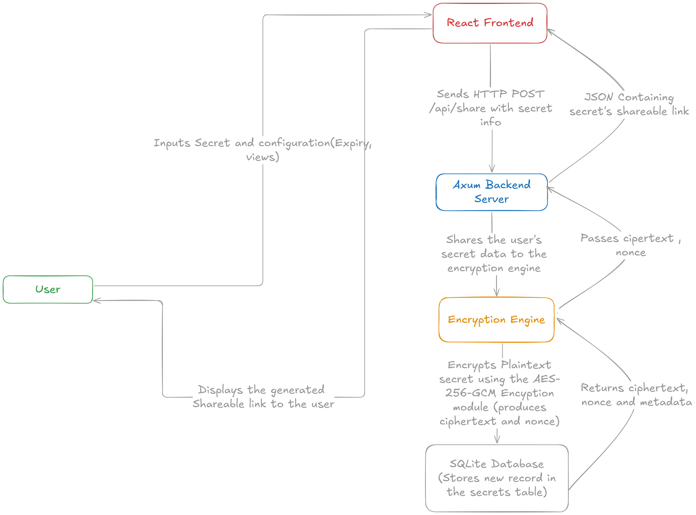

## KeyLock Project Overview

**KeyLock** is a secure, ephemeral password and secret sharing service. It works as a self-destructing password manager by enabling users to share secrets via temporary links that expire either after the first use or after a predefined time.

---

# Project Workflow

This is the workflow diagram for the project:




---

## Setup

### 1. `scripts/setup.sh` — Setup Environment and Database

This script automates the initial setup of your development environment, including installing dependencies and preparing the SQLite database.

**How to use:**

Before running this script, create a `backend/.env` file containing your `DATABASE_URL`. For example:

```text
DATABASE_URL=sqlite:./data/secrets.db
```

Make sure to add `backend/.env` to your `.gitignore` file to keep your secrets safe and avoid pushing them to GitHub.

Run the setup script from your project root:

```bash
bash scripts/setup.sh
```

The script will:

- Check for the `backend/.env` file and load the environment variables securely.
- Install Rust backend dependencies.
- Install frontend (React) dependencies.
- Setup your SQLite database and run any Diesel migrations.

After completion, it will prompt you to run the dev server script.

### 2. `scripts/dev.sh` — Start Backend and Frontend Locally

This script starts both your Rust backend server and React frontend development server concurrently for easy local development.

**How to use:**

Run from your project root:

```bash
bash scripts/dev.sh
```

What this does:

- Starts the backend API server (`cargo run` in `backend/`) listening on port 3001.
- Starts the React frontend dev server (`npm run dev` in `frontend/`) on port 3000.
- Ensures both processes are managed together and terminated properly on exit.

